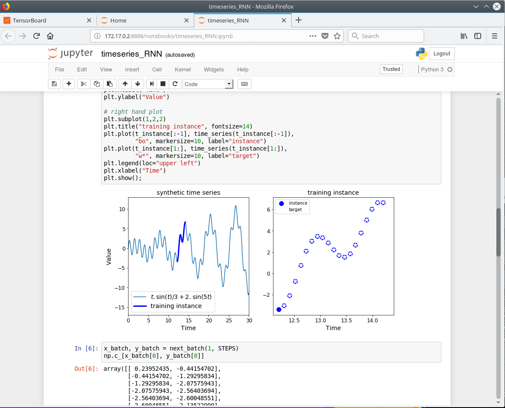
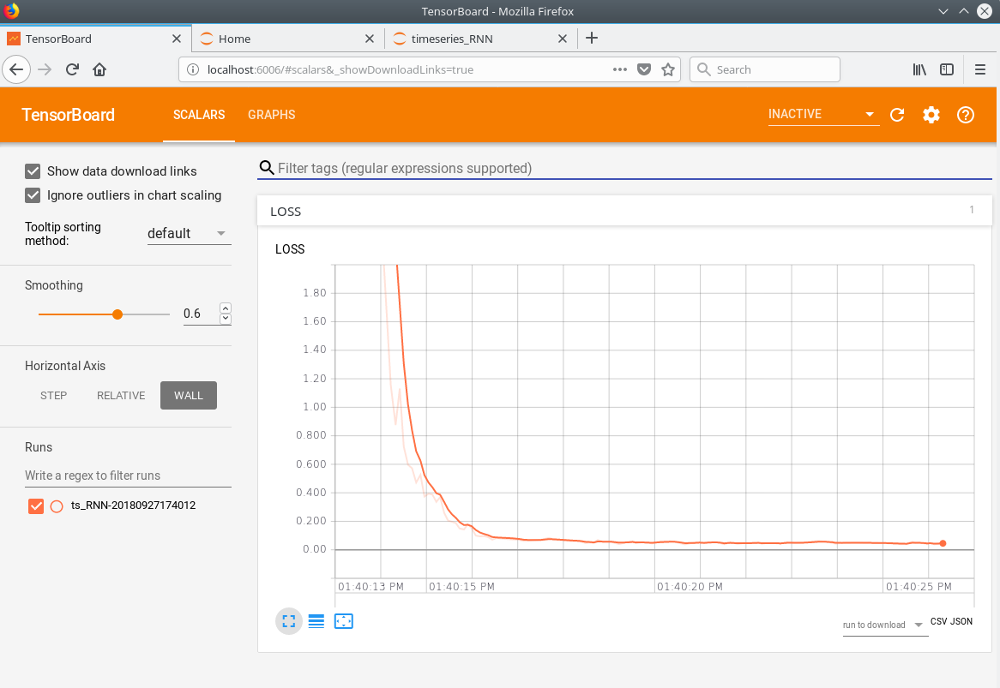
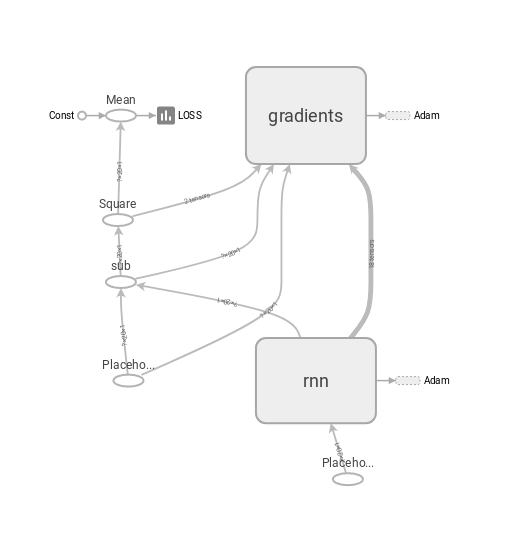
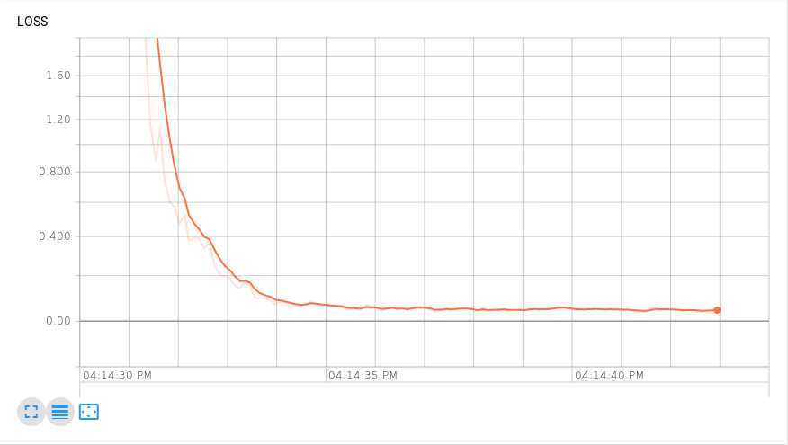

Deeplearning
============

*Deep-learning in a box*. Simple, one liner. An image with all must-have deep-learning tools and a sample of time series prediction using a recurrent neural network.

[License](LICENSE)

One image host complete with PyNum, Pandas, Tensorflow, Tensorboard, and all the other must-have deep-learning tools. To activate it, one command, one line:

```bash
docker run -p 8888:8888 -p 6006:6006 -v `pwd`:/work --name dl deeplearning
```

This of course assumes you have `docker` installed with `sudo` privileges. The first time you run this command the latest image will be downloaded from [my docker hub](https://hub.docker.com/r/jfaleiro/).

To use it, after activation, just point your browser to one of the ports `8888` for your Jupyter console:




...and `6006` for your Tensorboard dashboard:




The image carries a toy example of a time series prediction model using RNN. You can browse through the example in the notebook `timeseries_RNN.ipynb`. 

After you execute it once, you will be able to click through the dashboard to visualize the RNN Tensorflow graph:




The execution also generates the convergence plot of the loss function, decaying asymptotically to near zero in a span of a few seconds:




You can adjust the model for prediction of other time series, or create new ones, leveraging the same framework.

Enjoy!